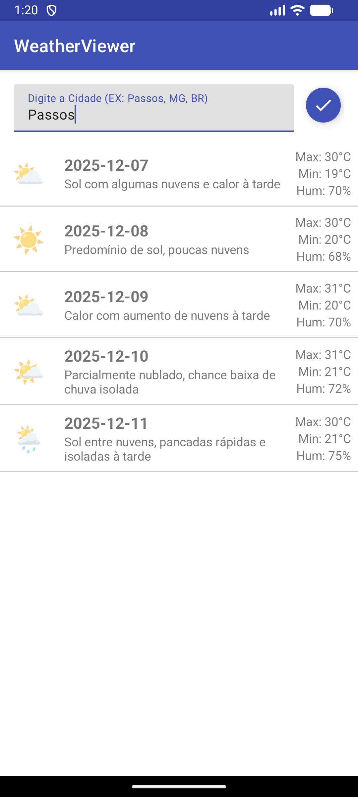

# WeatherViewer 🌦️


Aplicação Android nativa para consulta de previsão do tempo, desenvolvida como atividade prática da disciplina de Programação III.


Este projeto é uma adaptação moderna do "WeatherViewer App" (Capítulo 7 do livro *Android for Programmers*), ajustado para consumir uma API REST personalizada hospedada na AWS.


## 👨‍🎓 Identificação do Aluno


* **Nome:** Guilherme Reis Pereira

* **Instituição:** UEMG - Unidade Passos

* **Curso:** Sistemas de Informação

* **Disciplina:** Programação III

* **Semestre:** 2025/02


## 📱 Preview do Aplicativo

<div align="center">
  
</div>


## 📱 Sobre o Projeto


O aplicativo permite que o usuário consulte a previsão do tempo para os próximos 7 dias de qualquer cidade. Ele demonstra conceitos fundamentais de desenvolvimento Android, incluindo:


* **Networking:** Consumo de Web Service REST (JSON) utilizando `HttpUrlConnection`.

* **Multithreading:** Execução de tarefas em background com `AsyncTask` para não travar a UI.

* **JSON Parsing:** Processamento de dados complexos com `JSONObject` e `JSONArray`.

* **UI/UX:**

    * Uso de `ListView` com `ArrayAdapter` personalizado e padrão ViewHolder.

    * Tratamento de erros robusto (distinção entre "Sem Internet" e "Cidade não encontrada").

    * Feedback visual de carregamento (`ProgressBar`).

    * Design Material com `TextInputLayout` e `FloatingActionButton`.

    * Barra de status personalizada.


## 🛠️ Configuração e Execução (Método Seguro)


Como medida de segurança ("Software Engineering Observation 7.1"), a Chave da API **não** foi incluída no controle de versão. Para executar o projeto, siga os passos:


1.  Clone este repositório.

2.  Abra o projeto no Android Studio.

3.  Crie um arquivo chamado `local.properties` na raiz do projeto (caso não exista).

4.  Adicione a seguinte linha ao arquivo `local.properties`:


```properties

WEATHER_API_KEY=AgentWeather2024_a8f3b9c1d7e2f5g6h4i9j0k1l2m3n4o5p6;
```


Ou troque no MainActivity.java:

```properties
private final String API_KEY = BuildConfig.API_KEY;
```
Por
```properties
private final String API_KEY = "AgentWeather2024_a8f3b9c1d7e2f5g6h4i9j0k1l2m3n4o5p6";
```
